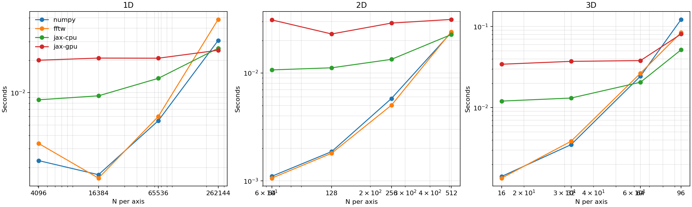
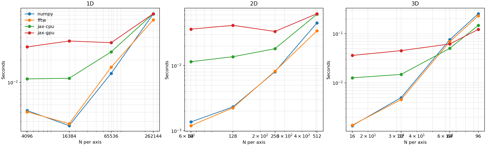

Backend benchmark scaling
=========================

This page tracks the current performance of the NumPy and JAX implementations on a
real development machine. It serves two purposes:

1. document the current speed trade-offs across backends;
2. provide a reproducible profiling baseline as the JAX implementation evolves.

Benchmark setup
---------------

The benchmark script is ``docs/demos/benchmark_backends.py``. It measures the median of
two timed runs after one warm-up run for each configuration, using cubic boxes with
shapes ``(N,)*dim`` and ``boxlength=100``. The current size ladders are
``[4096, 16384, 65536, 262144]`` in 1D, ``[64, 128, 256, 512]`` in 2D, and
``[16, 32, 64, 96]`` in 3D.

The four compared backends are:

- ``numpy`` using ``powerbox.PowerBox(..., nthreads=1)`` and ``powerbox.get_power(..., nthreads=1)``;
- ``fftw`` using ``powerbox.PowerBox(..., nthreads=1)`` and
  ``powerbox.get_power(..., nthreads=1)``;
- ``jax-cpu`` using ``powerbox.jax`` pinned to the JAX CPU device;
- ``jax-gpu`` using ``powerbox.jax`` pinned to the JAX CUDA device.

The FFTW series is intentionally single-threaded for these problem sizes. On this
machine, the pyFFTW interface overhead and thread-management cost dominate before
multi-threading starts to help, so a one-thread FFTW run gives a fairer rule-of-thumb
comparison against NumPy. The FFTW backend now also enables the pyFFTW interface cache,
so repeated transforms of the same shape can reuse plans instead of paying the setup
cost on every call.

These measurements were generated on this development system with an NVIDIA RTX A2000
Laptop GPU. JAX was run with ``jax_enable_x64=True`` so the comparisons stay closer to
the default NumPy/FFTW precision used by ``powerbox``.

Regenerating the plots
----------------------

Run the script from the repository root:

.. code-block:: bash

   uv run python docs/demos/benchmark_backends.py

If you want the GPU series, install a CUDA-enabled JAX build into the environment
first, for example:

.. code-block:: bash

   uv pip install 'jax[cuda12]'

Gaussian field generation
-------------------------

After switching the real-field generation path to reduced half-spectra plus
``irfftn``, the JAX generation timings improved substantially. The larger size ladder now
shows the crossover more clearly: NumPy remains a strong baseline at modest sizes, FFTW
becomes more competitive once plan reuse has a chance to matter, and the JAX backends are
most interesting in the larger 2D and 3D cases.

   Median runtime for generating Gaussian fields with ``PowerBox`` / ``powerbox.jax.PowerBox``.

Fully averaged power spectra
----------------------------

For fully averaged power spectra, the current JAX implementation remains competitive at
larger problem sizes. The updated FFTW series should now be interpreted as a
single-threaded, plan-reusing reference point rather than a "maximal tuning" result; it
is meant to answer the practical question "what happens if I switch this workflow to
FFTW?" on a typical development machine.

   Median runtime for fully averaged power-spectrum estimation with ``get_power`` /
   ``powerbox.jax.get_power``.

Notes
-----

- The JAX timings here are eager-mode timings for the current milestone-1 implementation,
  not JIT-compiled kernels.
- The GPU line is particularly useful as a development target: if future JAX refactors
  regress it noticeably, rerunning the benchmark script should reveal that quickly.
- The raw metadata and timing table are written to
  ``docs/_static/backend_benchmark_results.json`` by the benchmark script.
